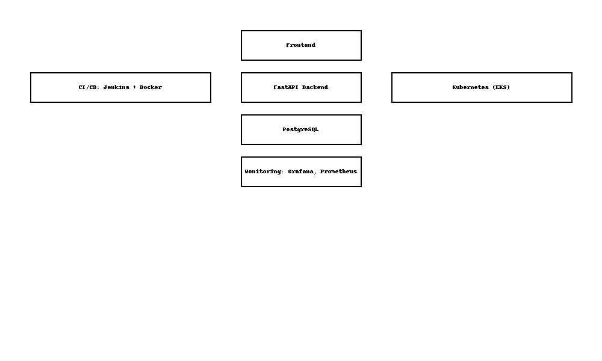

# 🚘 Central Bank Fleet Management System (CB-FMS)

> A secure, scalable, and fully automated **vehicle fleet and operations management platform** for national financial institutions.

[](https://github.com/elvispronda/devops-fleet/actions)
[]()
[]()
[]()


------------------------------------------------------------------------------------------------------------
------------------------------------------------------------------------------------------------------------
## 🧭 Executive Summary

This project powers a **centralized fleet management ecosystem** for a national central bank. It provides full lifecycle visibility and control of official vehicle resources across:

- ✅ **Trip Planning & Assignment**
- ✅ **Fuel, Maintenance & Repair Tracking**
- ✅ **Driver Lifecycle Management**
- ✅ **Cost Control & Real-Time Analytics**
- ✅ **Government Compliance & Reporting**

It is **designed for high-availability**, **secured via enterprise DevSecOps practices**, and **monitored at scale** with full CI/CD pipelines for code quality, security, and operational integrity.

------------------------------------------------------------------------------------------------------------
------------------------------------------------------------------------------------------------------------
## 🏗️ Architecture Overview

 <!-- You can replace this with your actual diagram -->

| Layer               | Stack                                              |
|---------------------|----------------------------------------------------|
| **Frontend**        | HTML5, TailwindCSS, Vanilla JavaScript             |
| **Backend API**     | FastAPI, Pydantic, SQLAlchemy, JWT Auth            |
| **Database**        | PostgreSQL (managed RDS)                           |
| **CI/CD**           | Jenkins + GitHub + Docker + Kubernetes + Helm      |
| **Infrastructure**. | Terraform (AWS), Ansible (configuration)           |
| **Containerization**| Docker, Docker Compose                             |
| **Orchestration**   | EKS (AWS Kubernetes) + Helm + Nginx/Traefik        |
| **Security**        | SonarQube, Trivy, HTTPS, SealedSecrets             |
| **Monitoring**      | Prometheus, Grafana, Loki, AlertManager            |


------------------------------------------------------------------------------------------------------------
------------------------------------------------------------------------------------------------------------
## 🔐 Subdomain Map (with SSL)

| Subdomain                       | Service                      |
|---------------------------------|------------------------------|
| `app.fleet.centralbank.gov`     | Web frontend UI              |
| `api.fleet.centralbank.gov`.    | REST API backend (FastAPI)   |
| `jenkins.fleet.centralbank.gov` | Jenkins CI/CD                |
| `monitor.fleet.centralbank.gov` | Prometheus + Grafana         |
| `sonar.fleet.centralbank.gov`   | SonarQube (code quality)     |

> All traffic is routed through **Traefik** Ingress with **HTTPS (Let's Encrypt)** SSL termination. Services are segmented by namespace and access roles.

------------------------------------------------------------------------------------------------------------
------------------------------------------------------------------------------------------------------------
## ⚙️ DevOps Automation Highlights

✅ **Push-to-Deploy** via GitHub/Jenkins  
✅ Docker images scanned using **Trivy**  
✅ Code quality enforced by **SonarQube**  
✅ Infrastructure-as-Code with **Terraform** (modular stacks)  
✅ Server setup with **Ansible**  
✅ Monitored using **Prometheus + Grafana + Loki**  
✅ Secrets managed securely via **AWS Secrets Manager + SealedSecrets**  
✅ Notification support via **SMTP (Email alerts)**


------------------------------------------------------------------------------------------------------------
------------------------------------------------------------------------------------------------------------
## ✨ Core Features

### Vehicle Management
- Add, update, retire central bank vehicles
- Track condition, cost, ownership, and lifetime usage

### Trip & Assignment Planning
- Create official trips, assign vehicles and drivers
- Real-time trip tracking with status (pending, active, closed)

### Fuel & Repair Expense Management
- Log fuel purchases, repairs, part replacements
- Capture receipts from external garages and services

### Maintenance & Scheduling
- Predictive maintenance alerts (based on mileage or date)
- Service history per vehicle

### Dashboard & KPIs
- Total monthly operational cost
- Fleet availability rate
- Repair frequency per vehicle
- Fuel usage per trip or driver

### Roles & Access Control
- Admin (Full control)
- Fleet Officer (Trips, maintenance)
- Finance (Expense approval)
- Driver (View trips only)

------------------------------------------------------------------------------------------------------------
------------------------------------------------------------------------------------------------------------
## 📦 Project Structure

```bash
devops-fleet/
├── backend/           # FastAPI backend service
│   ├── app/           # Application modules
│   └── main.py        # Entry point
├── frontend/          # HTML, CSS, JS static UI
│   └── index.html     # Web UI
├── ci-cd/             # Jenkinsfile, SonarQube, Trivy scans
│   └── Jenkinsfile
├── infra/             # Terraform (IaC), Ansible (provisioning)
│   ├── terraform/     # Infrastructure modules
│   └── ansible/       # Server setup playbooks
├── docker/            # Dockerfiles, Traefik config
│   └── traefik/
├── k8s/               # Kubernetes manifests, Helm charts
│   ├── ingress/
│   └── deployments/
├── monitoring/        # Prometheus, Grafana, Loki setup
├── notifications/     # Email alerts, SMTP config
├── scripts/           # Full automation CLI scripts
│   └── git_push_all.sh
├── .env.example       # Example environment config
├── .gitignore
└── README.md
```


------------------------------------------------------------------------------------------------------------
------------------------------------------------------------------------------------------------------------
## 🚀 Quick Start (Local Dev)

```bash
# Clone the project
git clone https://github.com/ndayishimiyeelvis/my_web_app.git
cd my_web_app

# Launch local containers
docker-compose up --build

# Run setup script for DevOps
./scripts/setup.sh


------------------------------------------------------------------------------------------------------------
------------------------------------------------------------------------------------------------------------
🔐 Security & Compliance

   . 🔎 Static Code Analysis with SonarQube

   .🛡️ Container Scanning with Trivy (OWASP compliance)

   . 🔐 HTTPS SSL encryption with Let's Encrypt + Traefik

   . 🔑 Secrets encrypted with Ansible Vault and SealedSecrets

   . 🔒 RBAC policies in Kubernetes

   . 📧 Email notifications for suspicious activity or failure events


------------------------------------------------------------------------------------------------------------
------------------------------------------------------------------------------------------------------------
📊 Monitoring & Alerting

    .Real-time dashboards (Grafana)

    .Custom Prometheus metrics

    .Uptime, memory, CPU, and DB query response monitoring

    .Alertmanager for service incidents + email triggers


------------------------------------------------------------------------------------------------------------
------------------------------------------------------------------------------------------------------------
📧 Contact & Social Links

Maintainer: Ndayishimiye Elvis
DevOps | Full Stack | Infrastructure-as-Code | Secure Cloud Architect

    .🔗 LinkedIn

    .🧑‍💻 GitHub

    .🐦 Twitter/X

    .🌍 Personal Portfolio

    .📸 Instagram

Contact me for consulting, partnerships, or to contribute.

------------------------------------------------------------------------------------------------------------
------------------------------------------------------------------------------------------------------------
📄 License

    Confidential - Central Bank Use Only
    Redistribution, duplication, or derivative work is strictly prohibited unless formally approved by the Central Bank legal office.


------------------------------------------------------------------------------------------------------------
------------------------------------------------------------------------------------------------------------
🤝 Future Roadmap

    .Mobile app version for drivers

    .GPS tracking integration

    .PDF export of reports/invoices

    .Budget planning & forecasting AI

    .Voice command for trip dispatch


------------------------------------------------------------------------------------------------------------
------------------------------------------------------------------------------------------------------------

## ✅ What's Next

Would you like me to:
- Add an **architecture diagram template** (`architecture_diagram.png`)?
- Populate the actual `main.py`, `docker-compose.yml`, and `Jenkinsfile`?
- Set up a `CI badge` using GitHub Actions as a fallback?

Let me know how far you want to go — I’m ready to make this **enterprise-ready and demoable.**
